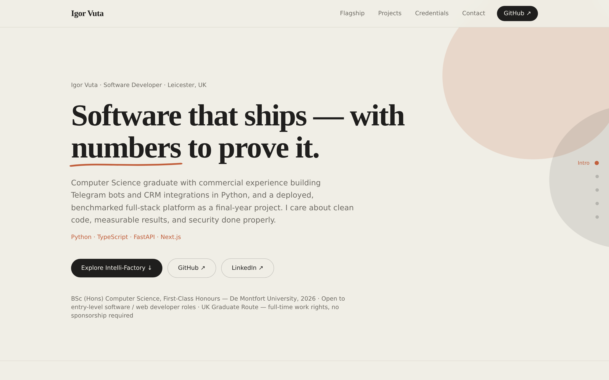
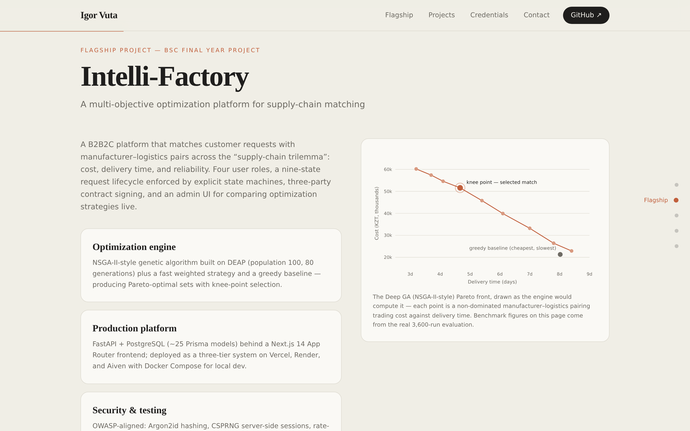

<div align="center">

# igor-vuta.github.io/portfolio

**Personal portfolio — an editorial, animation-driven one-pager built with zero UI libraries.**

[](https://igor-vuta.github.io/portfolio/)


<br /><br />



</div>

---

## Design

Editorial light theme: oat background, high-contrast serif display type, a single clay accent, and a dark charcoal contact block. The design language borrows from modern research-lab sites — restraint over decoration.

## ✨ Signature animations (all hand-rolled, no libraries)

- 📈 **Self-drawing Pareto chart** — the SVG front line draws itself when scrolled into view, points fade in sequentially, the knee-point pulses
- 🔢 **Count-up metrics** — benchmark numbers animate from zero on first view, preserving prefixes/suffixes and formatting
- ✍️ **Hand-drawn underline** — the hero headline's accent stroke draws in on load
- 🫧 **Breathing blobs** — slow, organic background motion in the hero
- 🧭 **Section rail** — dot navigation that tracks the active section, with hover labels
- 📊 **Reading progress bar** — a hairline clay indicator under the nav
- 🟢 **Live badge** — pulsing indicator on the flagship demo button
- 📋 **Copy-email button** — one-tap clipboard with inline confirmation

Every animation respects `prefers-reduced-motion`.

<div align="center">

</div>

## 🛠 Stack & architecture

- **Next.js 15** (App Router) · **React 19** · **TypeScript** · **Tailwind CSS v4**
- Static export (`output: "export"`) — no server, deploys anywhere
- All content lives in **one file**: [`lib/profile.ts`](lib/profile.ts) — links, metrics, projects, certifications
- First Load JS ≈ 103 kB; fonts loaded client-side with `display=swap`
- CI/CD: GitHub Actions → GitHub Pages on every push to `main`

## 🚀 Run locally

```bash
npm install
npm run dev      # http://localhost:3000/portfolio
npm run build    # static export to ./out
```

---

<div align="center">

**[Igor Vuta](https://github.com/igor-vuta)** · [LinkedIn](https://www.linkedin.com/in/igor-vuta-b88017390) · igor_vuta@proton.me

</div>
