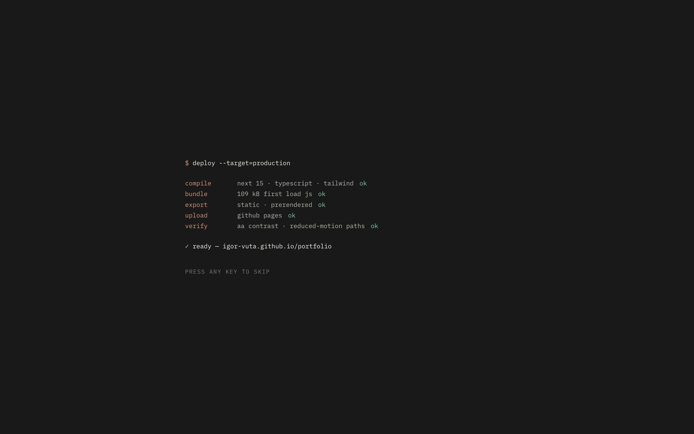
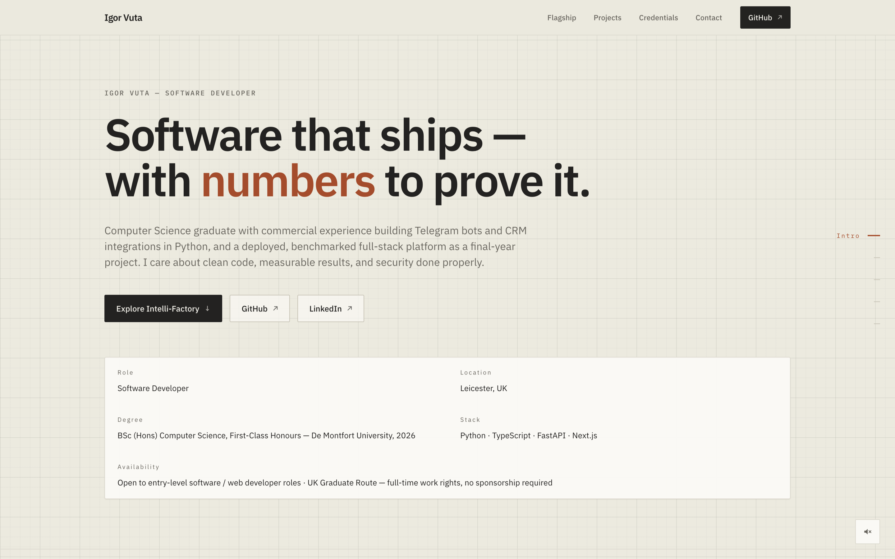
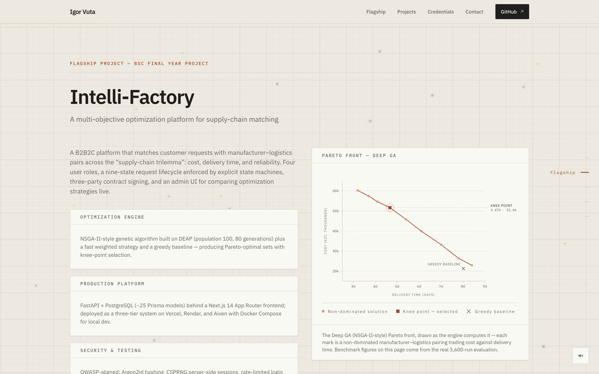
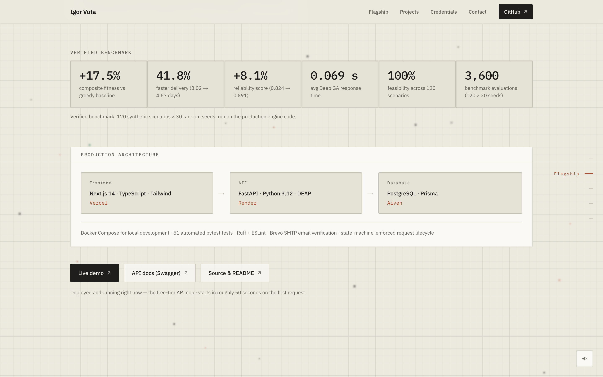
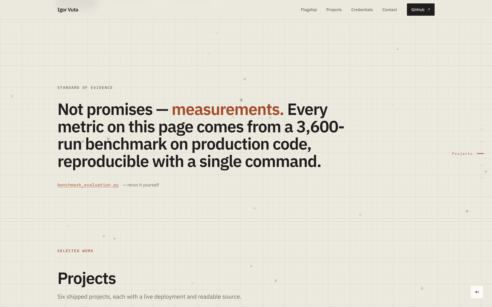
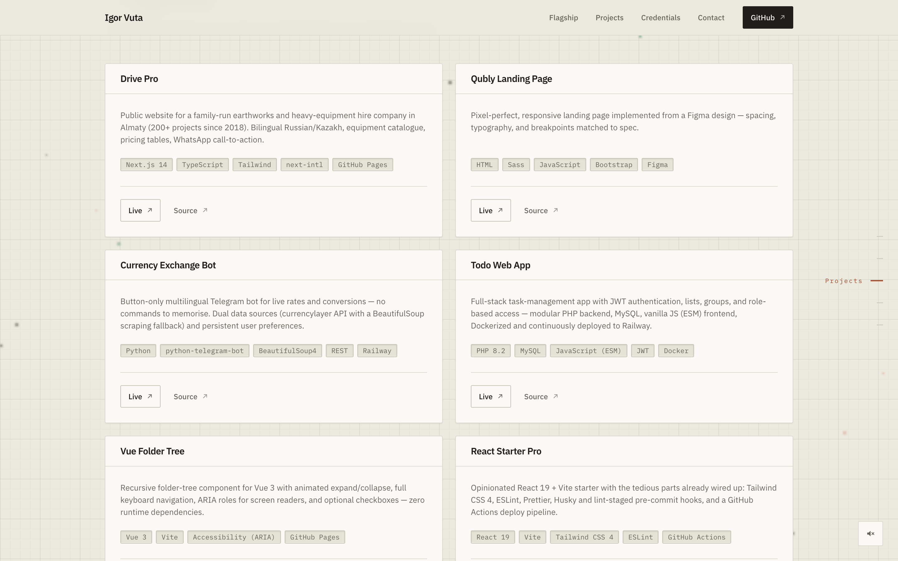
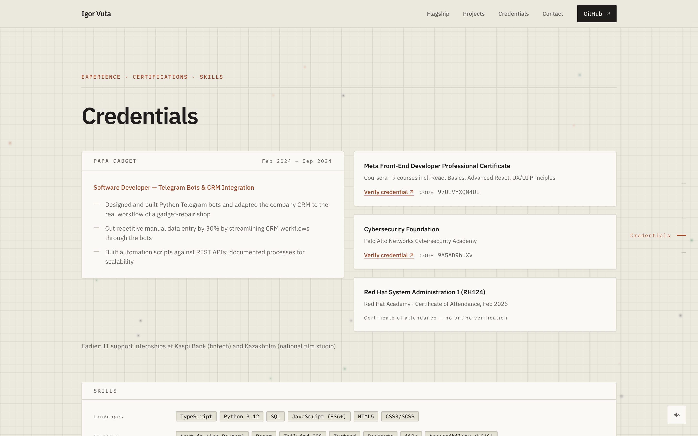
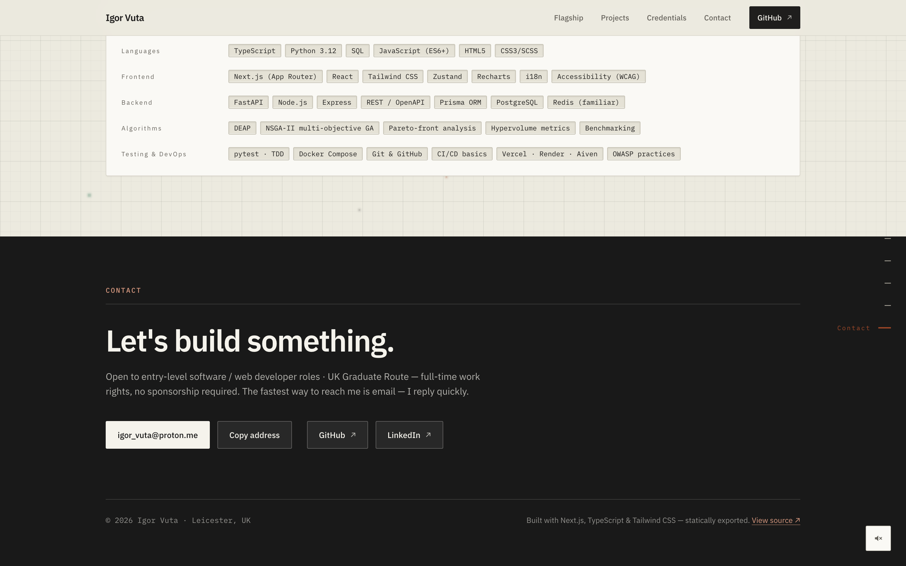

<div align="center">

# igor-vuta.github.io/portfolio

**My portfolio. One page, statically exported, no UI or animation libraries.**

[](https://igor-vuta.github.io/portfolio/)


</div>

---

## Boot

<div align="center">

</div>

The first visit in a session opens on a terminal that deploys the page you are about to read. The command types itself, five stages report in over about four seconds, and the page arrives behind it at 6.2s. Any key, tap, wheel or touch skips the whole thing, and the screen says so.

The figures printed are real properties of this build — Next 15, 109 kB first load, static export, GitHub Pages. A boot screen that lied about the thing it is booting would be a strange choice here.

It is decoration, so it runs under conditions:

1. It cannot withhold content. The markup is complete before the script runs, and every boot rule hangs off a class only that script adds. Thus a thrown exception, a blocked bundle, or scripting switched off all land on the finished page instead of a blank one.
2. It ends. A 6.4-second cap clears it even if a stage never fires, and the cap is a timeout set in the same breath as the class, not a completion callback from an animation that may never arrive.
3. It plays once per session, tracked in `sessionStorage`, and not at all under `prefers-reduced-motion`.

## Intro

<div align="center">

</div>

Name and role, the headline, three sentences of summary, and the three links a recruiter actually opens: the flagship project, GitHub, LinkedIn.

Under it a spec panel — role, location, degree, stack, availability — because those are the five facts every reader checks first and none of them should need scrolling to find. The whole page is styled this way: paper ground, a measuring grid, one clay accent, IBM Plex for the prose and the readouts both. Closer to a spec sheet than to a landing page.

## Flagship

<div align="center">

</div>

Intelli-Factory, my final-year project. It matches supply-chain requests against manufacturer–logistics pairs across three objectives that pull against each other — cost, delivery time, reliability — so there is no single best answer, only a Pareto front and a decision about what you are optimizing for. Three pillars cover the optimization engine, the production platform and the security work.

The chart is real data: the non-dominated set from the Deep GA run, cost against delivery time, with the knee point the engine selects. It draws itself when you arrive at it, since a line that appears fully formed says nothing about how it was arrived at.

<div align="center">

</div>

Then the evidence for those claims. Six metrics that count up from zero on first sight, the note saying exactly where they came from — 120 synthetic scenarios × 30 seeds, run on the production engine code — and the three-tier architecture that serves them. The buttons go to the live demo, the Swagger docs and the source, with the free-tier cold start stated rather than left as a surprise.

## Standard of evidence

<div align="center">

</div>

One line between the flagship and the projects, and the only band on the page with no panel, no index and no controls. It states where every number came from and links `benchmark_evaluation.py` so you can rerun it yourself.

## Selected work

<div align="center">

</div>

Six shipped projects, each with a live deployment and readable source: a bilingual company site, a Figma-to-spec landing page, a Telegram bot, a full-stack task manager, a Vue tree component and a React starter. Every card carries its stack and both links.

**Live** opens in place rather than in a tab. The links are ordinary `<a href target="_blank">` elements intercepted by delegation and shown in a native `<dialog>`, so focus trapping and Esc-to-close come from the platform, cmd/ctrl/shift/middle clicks still give you a real tab, and with no JS every link is still a link. A site that refuses to be framed renders blank and nothing cross-origin can detect that, hence the permanent **Open ↗** in the panel header.

## Credentials

<div align="center">

</div>

Commercial experience, certifications and skills in one section. Each certificate carries its verification link and code, and the Red Hat one is labelled a certificate of attendance with no online verification, because it is one and pretending otherwise is the kind of thing that gets checked.

## Contact

<div align="center">

</div>

The page stops being paper and turns dark, so the end reads as an end. Availability, visa status, and four ways to get in touch. The copy-address button falls back to a hidden textarea where the Clipboard API is absent or denied, and if both routes fail it says so and puts the address on screen pre-selected — a button that fails silently is unfinished.

## Stack

- **Next.js 15** (App Router) · **React 19** · **TypeScript** · **Tailwind CSS v4**
- Static export (`output: "export"`) — no server, no runtime, deploys anywhere
- **109 kB First Load JS** for `/`, of which 103 kB is shared, measured on the build in this repo
- Dependencies: `next`, `react`, `react-dom`. Every animation on the page is handwritten.
- IBM Plex Sans and Mono, self-hosted at build time through `next/font`, Latin subset only, `display: swap`
- All content is in one file, [`lib/profile.ts`](lib/profile.ts) — identity, metrics, projects, certifications. Changing what the page says never means touching a component.
- Reduced motion, forced colors, print and no-JS are all real paths, not disabled animations
- GitHub Actions builds and publishes to Pages on every push to `main`

## Run it

```bash
npm install
npm run dev      # http://localhost:3000/portfolio
npm run build    # static export to ./out
```

## Screenshots

In [`docs/screenshots/`](docs/screenshots), captured at 1440×900 at 2×. They go stale as the page changes, so the [live site](https://igor-vuta.github.io/portfolio/) is the source of truth.

---

<div align="center">

**[Igor Vuta](https://github.com/igor-vuta)** · [LinkedIn](https://www.linkedin.com/in/igor-vuta-b88017390) · igor_vuta@proton.me

</div>
