<!-- project-presentation:start -->

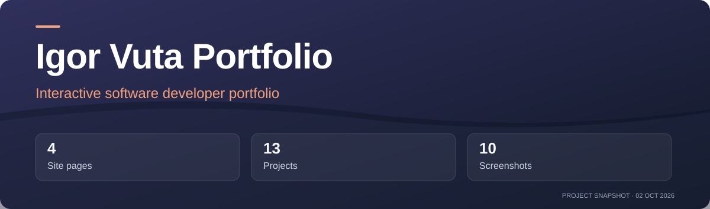

**[Open project](https://igor-vuta.github.io/portfolio/)** · [Repository activity](https://github.com/igor-vuta/portfolio/activity)

[](https://github.com/igor-vuta/portfolio/commits)
[](https://github.com/igor-vuta/portfolio)

**4** Site pages · **13** Projects · **10** Screenshots

*Project facts checked 2 October 2026. Activity badges update from GitHub.*

<!-- project-presentation:end -->

<div align="center">

# igor-vuta.github.io/portfolio

**My portfolio. A dive through four pages, statically exported, no UI or animation libraries; one 3D object.**

[](https://igor-vuta.github.io/portfolio/)


</div>

---

## Boot

<div align="center">
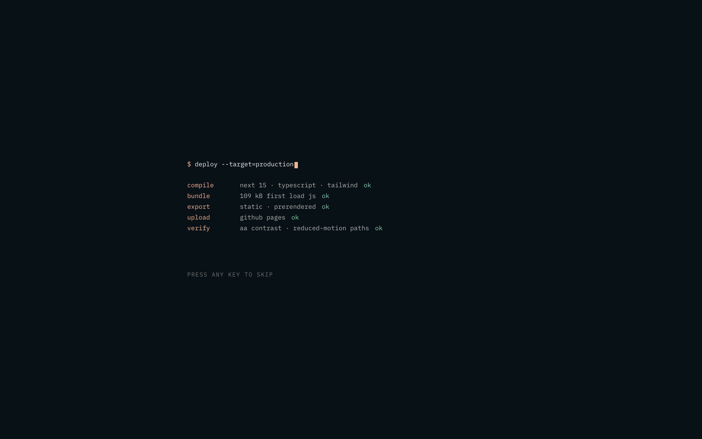
</div>

The first visit in a session opens on a terminal that deploys the page you are about to read. The command types itself, five stages report in, and the page surfaces behind it. Any key, tap, wheel or touch skips the whole thing, and the screen says so.

The figures printed are real properties of this build: Next 15, 112 kB first load, static export, GitHub Pages. A boot screen that lied about the thing it is booting would be a strange choice here.

It is decoration, so it runs under conditions: it cannot withhold content (every boot rule hangs off a class only the head script adds), it always ends (a 6.4-second cap set in the same breath as the class), and it plays once per session, never under `prefers-reduced-motion`.

## The surface

<div align="center">
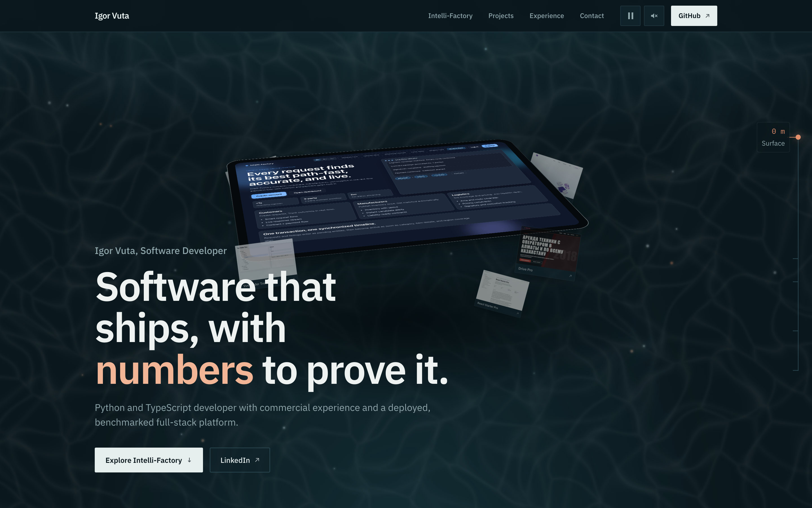
</div>

The page is a dive. It opens on dark water with light moving through it, and a tablet lying back on the surface running the flagship.

<div align="center">
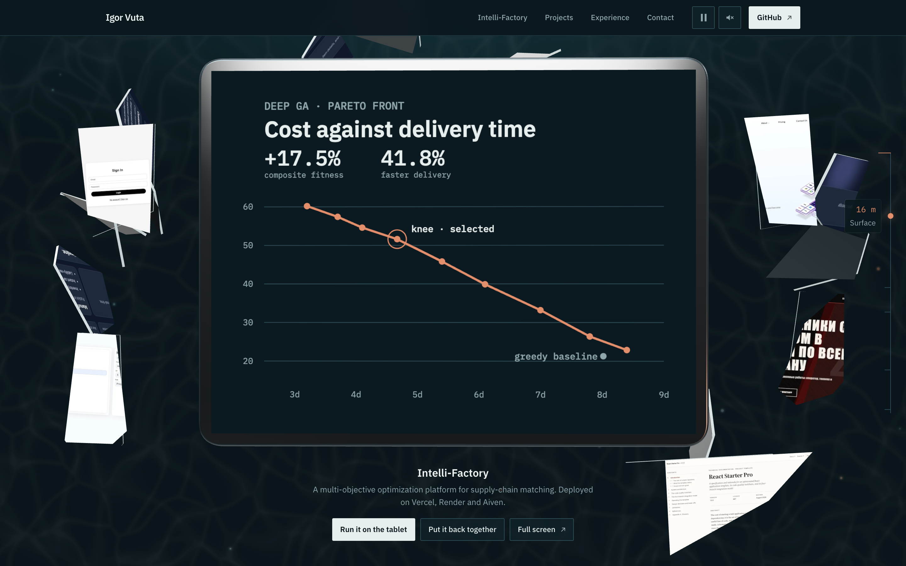
</div>

Scroll, and it rolls upright to face you while the other live projects float out into orbit. Every device screen and card is a capture of the deployed site, not drawn UI, and once the tablet is upright **Run it on the tablet** loads the real Intelli-Factory inside it, at the tablet's own width, so you see the layout it actually serves an iPad.

Where WebGL is available, the tablet is a real object. Drag it and it turns, with momentum, and springs back to face you. Once upright it holds, face on, for most of a screen of scrolling, so Intelli-Factory gets looked at before anything happens to it. Then, or whenever you click it, the screen cracks, the cracks light up, and it shatters: the pieces burn at the edges as they fly and cool as they land, and with sound on you hear it crack and the glass settle. It stays broken for a couple of screens, with a gentle snap stop just after the pieces land, and the pieces are there to be played with: grab one and throw it and it springs back to its place, and moving the pointer through them nudges them aside. The five largest shards carry the other live projects on their backs and fly out to where their cards sit, and hovering or clicking one opens that project. Behind the broken screen is what the interface is built on: the Deep GA's Pareto front, drawn from the same benchmark data as the case study. three.js is loaded on demand after the page is interactive, and the scene reads its layout from the HTML stage underneath, so it lands in the same place at every width.

The HTML stage is CSS scroll-driven animation with literal keyframes, so it runs on the compositor and follows the scroll exactly. It stays the design wherever the 3D does not run: reduced motion, no WebGL, no JavaScript and print. Browsers without scroll timelines (Firefox, today) get a finished still composition, not a broken animation.

## Choose your route

<div align="center">
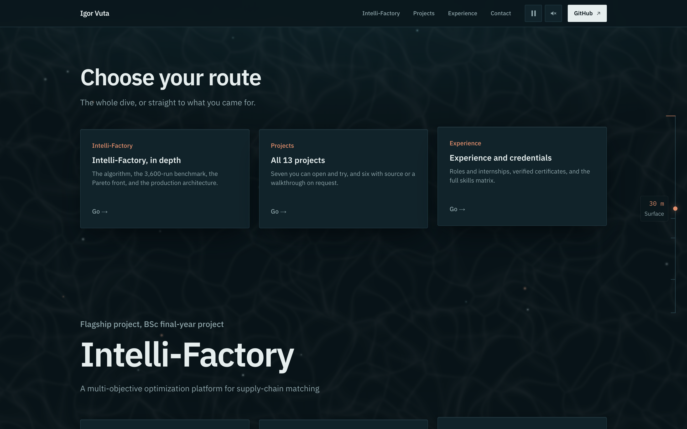
</div>

The dive forks. The home page is the condensed version: one short chapter per topic, each ending in a link to its own page, and a relay right after the stage for readers who already know what they came for. Every branch ends in the same relay, minus itself plus the way back, so no page is a dead end.

| Page | What is on it |
|---|---|
| `/` | The stage, the relay, and a short version of each chapter |
| `/intelli-factory/` | The case study: algorithm, Pareto front, benchmark, architecture |
| `/projects/` | All thirteen projects |
| `/experience/` | The logbook, certificates, and the skills matrix |

One list in [`lib/routes.ts`](lib/routes.ts) feeds the header, the home relay and every branch's relay. The water, header, contact block and TL;DR live in the layout, so moving between pages reads as moving through one place.

## Intelli-Factory

<div align="center">
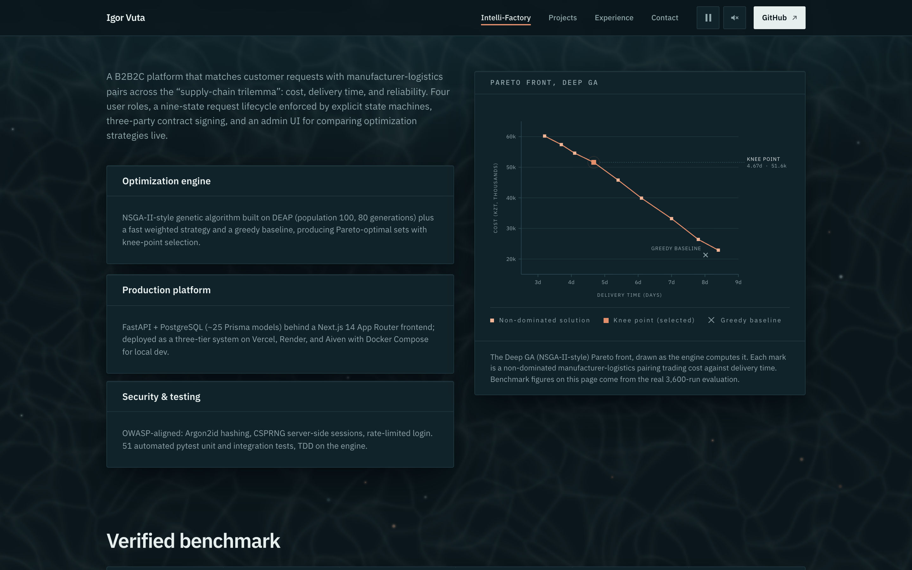
</div>

My final-year project. It matches supply-chain requests against manufacturer-logistics pairs across three objectives that pull against each other (cost, delivery time, reliability), so there is no single best answer, only a Pareto front and a decision about what you are optimizing for.

The chart is real data: the non-dominated set from the Deep GA run with the knee point the engine selects, drawn as you arrive at it.

<div align="center">
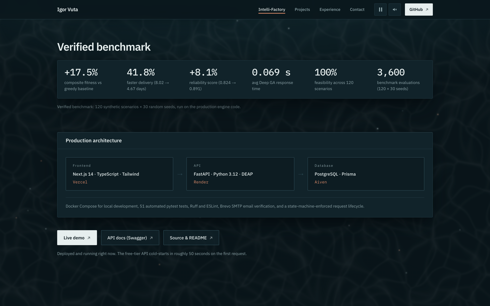
</div>

Then the evidence: six metrics from 120 synthetic scenarios × 30 seeds run on the production engine code, the three-tier architecture that serves them, and the free-tier cold start stated rather than left as a surprise.

## The current

<div align="center">
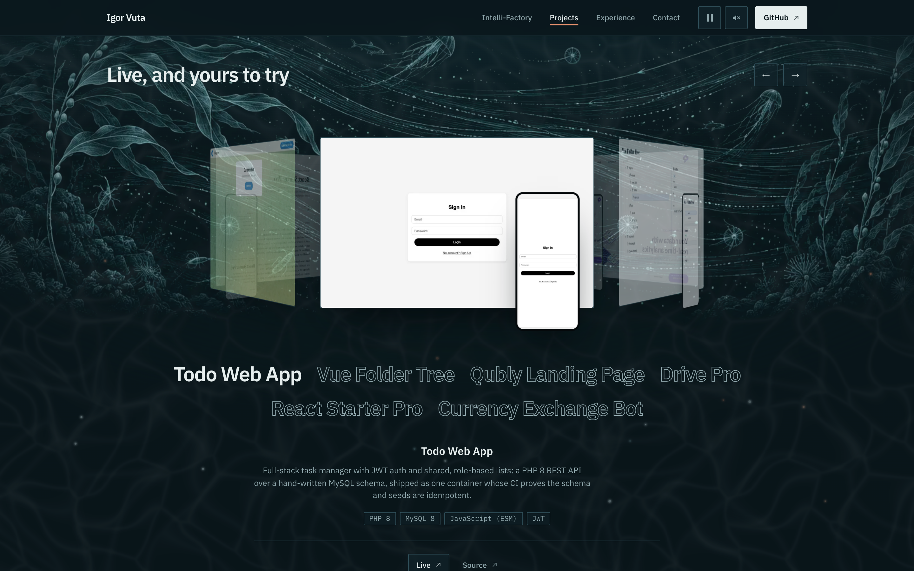
</div>

The live projects stand on a ring you turn by hand: drag it and it spins with momentum and settles on the nearest card, or use the arrows, the arrow keys, or the outlined names underneath, where the facing project's name fills in. Each card is two real captures of the deployment, the desktop layout with its phone layout stood in front of it, and the facing project's description and links sit below the ring. Open a card and its capture breaks into pieces before the live preview comes up. It is CSS 3D, not WebGL, so every card is still a real link.

Behind it, and behind the case study and the contact block, are the chapter plates. The caustic light behind the page already reads as a neural web, so each plate picks that up and straightens it into engineering: synapses lining up into a Pareto front, axons becoming circuit traces and code windows, a cluster wired into a server and a terminal. They are drawn on the page's ground colour, so only the lines come through over the moving light.

**Live** opens in place: ordinary `<a target="_blank">` links intercepted by delegation and shown in a native `<dialog>`, so cmd-click still gives you a real tab and with no JS every link is still a link.

## The synapses

The caustic light behind the page reads as a web of neurons, so there is one: a sparse graph drawn so faintly it vanishes behind text, which lights up around the pointer. Click open water and a signal travels outward along the links, one hop at a time; turn the project wheel, drop a card you dragged, or break the tablet open and a signal fires from there. Any card a signal reaches answers with a brief lantern edge. It is a plain 2D canvas that draws only while something is lit or moving, and it is off under reduced motion.

## Logbook

<div align="center">
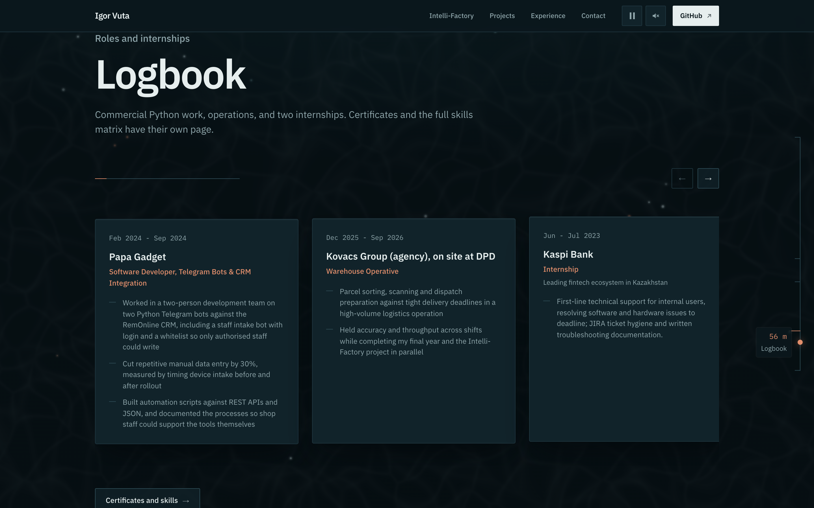
</div>

Roles and internships hang off one depth line, each marked with its period, with no card around them. The one measured result, 30% less manual data entry, is set as a figure rather than left in a bullet. On the Experience page, certificates and the skills matrix follow as ledgers on hairlines, with verification links and codes, and the Red Hat one is labelled a certificate of attendance, because it is one.

## TL;DR

<div align="center">
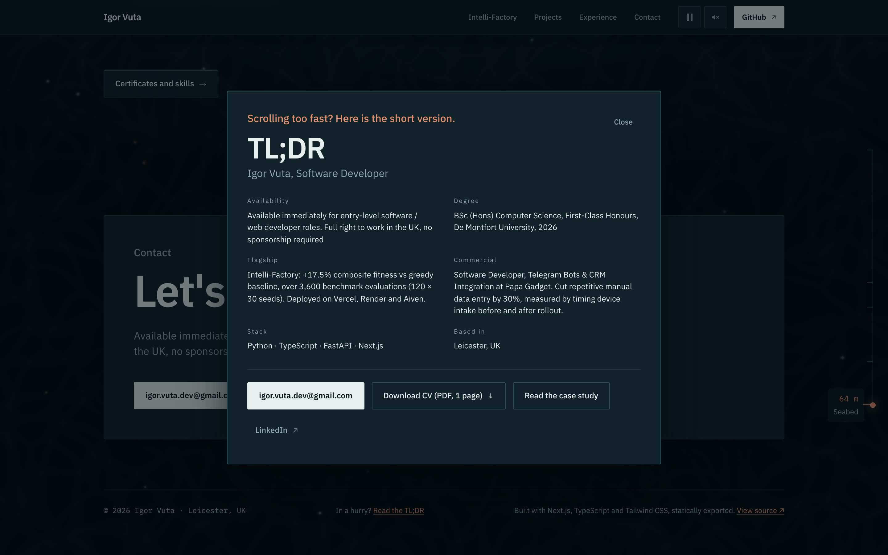
</div>

Race to the bottom of any page and a card surfaces with the facts a recruiter opens a portfolio to find, and a CV download. "Too fast" is measured as distance (three screen heights in 1.5 seconds), not sections passed, because a jump with End never intersects the sections it skips. It shows once per session; after that, a quiet line in the footer opens it.

## Contact

<div align="center">
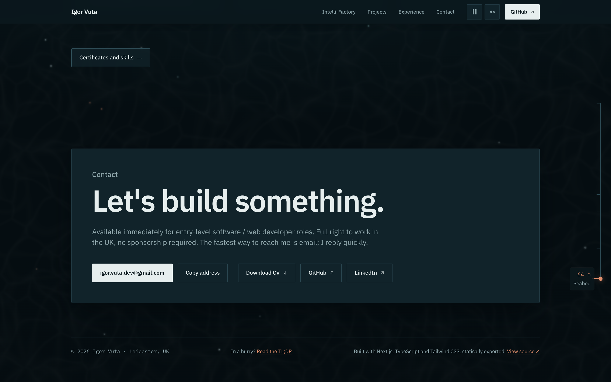
</div>

The seabed: the darkest water on the page, where the clay accent reads as the only light. The depth gauge on the right has been counting the whole way down. The copy-address button falls back to a hidden textarea where the Clipboard API is absent, and if both routes fail it says so and shows the address pre-selected.

## The water

Everything floats. Blocks bob, and any of them can be thrown with a mouse: it glides on along the throw, then drifts home. The pointer leaves a faint wake on open water, bubbles hang in the current, and ambient sound, if you turn it on, is generated water: a swell, laps, bubbles, and a splash where a thrown block lands. Nothing is a file.

It is built to cost nothing while you scroll. The caustic light is two pre-rendered sheets drifting on the compositor; there is no canvas, no SVG filter and no per-frame script. An earlier background wrote one custom property to `<html>` every scroll frame, which restyled the whole document (a 116 ms frame on an M3); removing it is what made the stage smooth. A pause control stops every ambient loop (WCAG 2.2.2), and reduced motion gets a still page.

## Stack

- **Next.js 15** (App Router) · **React 19** · **TypeScript** · **Tailwind CSS v4**
- Static export (`output: "export"`): four prerendered pages, no server, deploys anywhere
- **112 kB First Load JS** for `/`, of which 103 kB is shared, measured on the build in this repo. three.js loads afterwards, on demand, only where the 3D stage runs
- Dependencies: `next`, `react`, `react-dom`, and `three` for the stage tablet. Every animation is handwritten, and the motion is CSS scroll-driven animation wherever the browser supports it
- IBM Plex Sans and Mono, self-hosted through `next/font`, Latin subset only, `display: swap`
- Content is in [`lib/profile.ts`](lib/profile.ts); the pages are in [`lib/routes.ts`](lib/routes.ts). Changing what the site says never means touching a component
- Checked in Chromium, WebKit and Firefox; reduced motion, forced colours, print and no-JS are real paths
- GitHub Actions builds and publishes to Pages on every push to `main`

## Run it

```bash
npm install
npm run dev      # http://localhost:3000/portfolio
npm run build    # static export to ./out
```

## Screenshots

In [`docs/screenshots/`](docs/screenshots), captured at 1440×900 at 2×. They go stale as the page changes, so the [live site](https://igor-vuta.github.io/portfolio/) is the source of truth.

---

<div align="center">

**[Igor Vuta](https://github.com/igor-vuta)** · [LinkedIn](https://www.linkedin.com/in/igor-vuta-b88017390) · igor.vuta.dev@gmail.com

</div>
